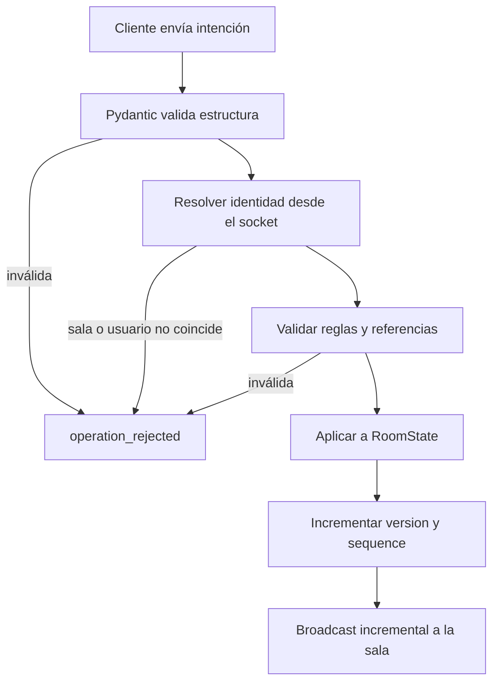
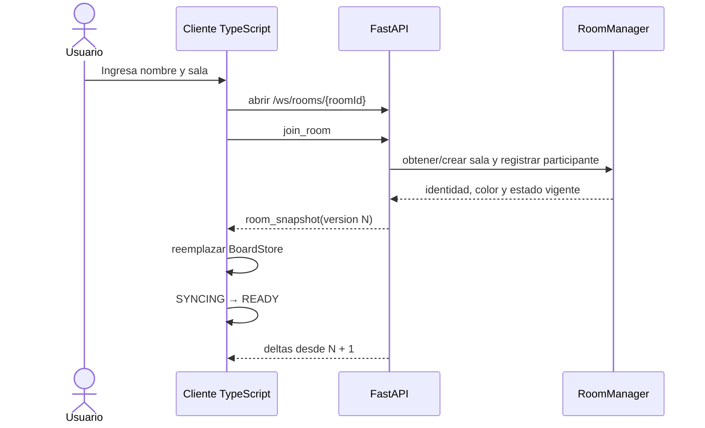
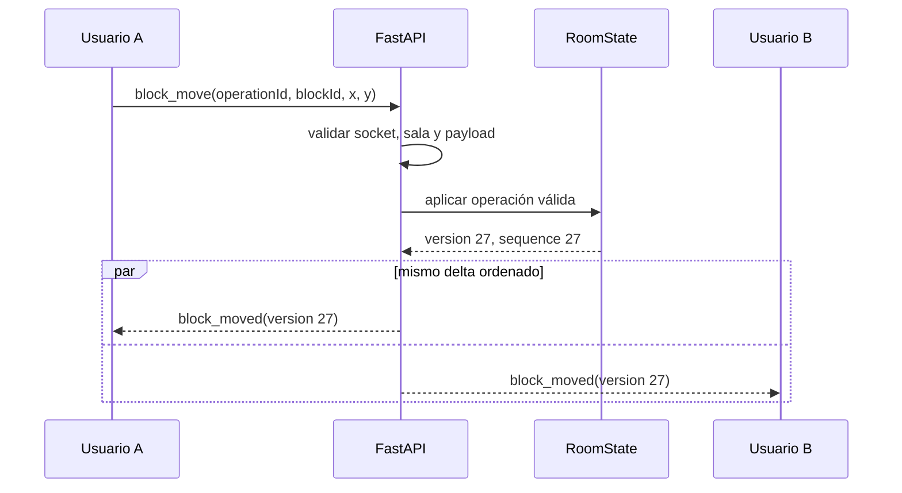
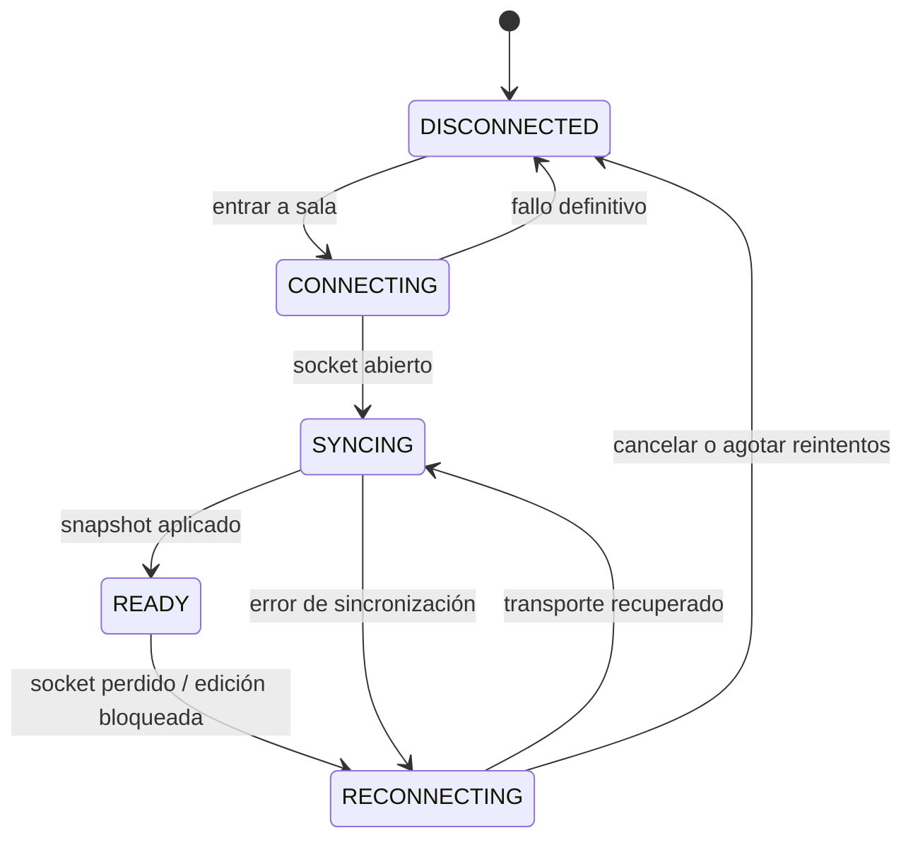
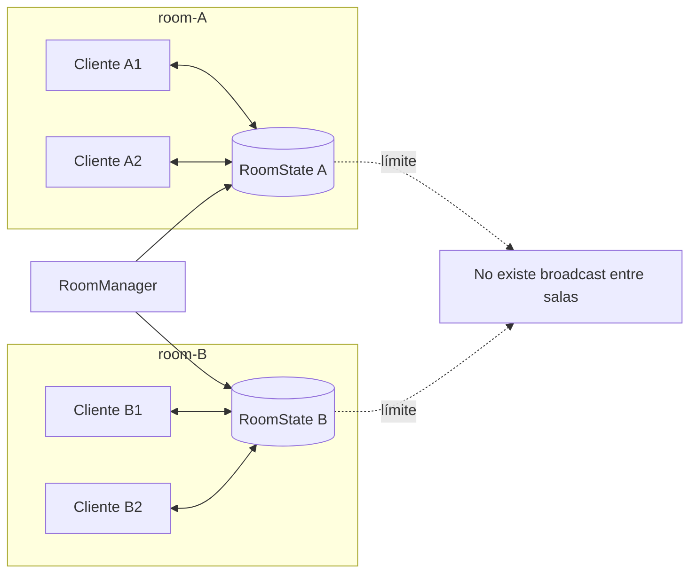

# Tablero colaborativo en tiempo real


## Inicio rápido

Requisitos: Docker Engine con Docker Compose v2.

```bash
docker compose up --build
```

Luego abra `http://localhost:3000` en dos ventanas, use nombres distintos y entre a la misma sala. La API expone su comprobación de salud en `http://localhost:8000/health` y el WebSocket en `ws://localhost:8000/ws/rooms/{roomId}`.

Para detener el entorno:

```bash
docker compose down
```

No hay volúmenes persistentes que borrar. `docker compose down` detiene los servicios y cualquier reinicio de `realtime-api` comienza sin salas previas.

## Desarrollo local

Requisitos adicionales: Node.js 22+, pnpm 10+ y Python 3.11+.

```bash
pnpm install
cd apps/realtime-api
python -m venv .venv
# PowerShell: .venv\Scripts\Activate.ps1
# Bash: source .venv/bin/activate
python -m pip install -e ".[dev]"
cd ../..
pnpm dev
```

Los comandos del monorepo son:

| Comando | Propósito |
|---|---|
| `pnpm dev` | Ejecuta las tareas persistentes de desarrollo |
| `pnpm build` | Construye aplicaciones y paquetes según dependencias |
| `pnpm lint` | Ejecuta las validaciones estáticas |
| `pnpm test` | Ejecuta las pruebas |
| `pnpm typecheck` | Verifica los proyectos TypeScript |

Puede copiar `.env.example` a `.env` para cambiar los puertos y la URL pública del WebSocket. `VITE_WS_URL` debe ser una URL accesible desde el **navegador**, no el nombre DNS interno de Compose; por eso el valor local predeterminado es `ws://localhost:8000`.

| Variable | Predeterminado | Uso |
|---|---|---|
| `WEB_PORT` | `3000` | Puerto publicado para Hono |
| `REALTIME_API_PORT` | `8000` | Puerto publicado para FastAPI |
| `VITE_WS_URL` | `ws://localhost:8000` | URL WebSocket incorporada al build del navegador |


### Diagrama 1: componentes

```mermaid
flowchart LR
    Browser[Browser] -->|HTTP :3000| Web[Hono + TypeScript]
    Web --> Client[Cliente en navegador]
    Client <-->|WebSocket /ws/rooms/roomId| API[FastAPI]
    subgraph SingleInstance[realtime-api · instancia única]
        API --> EV[EventValidator]
        EV --> RM[RoomManager]
        API --> CM[ConnectionManager]
        RM --> BS[(BoardState en memoria)]
        RM --> PM[PresenceManager]
        CM --> PM
    end
    Protocol[@collab/websocket-protocol] -. tipos .-> Client
```

## Modelo y responsabilidades

`RoomState` contiene `roomId`, `version`, participantes, bloques y conexiones. Cada bloque conserva posición, tamaño, texto y versión; cada conexión guarda únicamente los identificadores de sus bloques extremos. El navegador calcula las coordenadas visuales de la línea, evitando datos derivados inconsistentes. Los cursores son efímeros y nunca forman parte de `BoardState` ni de un snapshot.

`RoomManager` mantiene el diccionario `roomId → RoomState`, crea salas bajo demanda, aplica operaciones válidas y aumenta la versión por cada mutación persistente. `ConnectionManager` relaciona cada socket aceptado con la identidad y sala asignadas por el servidor, envía mensajes individuales, realiza broadcast sólo dentro de la sala y limpia conexiones muertas. Esta separación evita convertir el endpoint WebSocket en un controlador monolítico.

FastAPI es la única autoridad. El cliente envía **intenciones**; el servidor valida identidad, sala, tipo, payload y referencias antes de alterar el estado. Un `roomId` o `userId` declarado por el cliente no reemplaza la asociación interna `WebSocket → userId → roomId`.

## Protocolo WebSocket

Los mensajes usan un envelope con `type`, `roomId`, `userId`, `timestamp` y `payload`. Antes de que el servidor asigne identidad, `join_room` no necesita `userId`. Las mutaciones llevan `operationId` para correlación; los eventos persistentes aceptados llevan `version` y `sequence` para expresar el orden decidido por el servidor.

| Evento | Dirección | Persistente | Descripción |
|---|---|:---:|---|
| `join_room` | C → S | No | Solicita entrada con el nombre del participante |
| `snapshot_request` | C → S | No | Solicita recuperación explícita del estado vigente |
| `room_snapshot` | S → C | Sí | Estado completo al entrar, reconectar o recuperar |
| `participant_joined` | S → C | No | Informa presencia nueva |
| `participant_left` | S → C | No | Informa desconexión |
| `cursor_move` | C ↔ S | No | Propaga una posición efímera de cursor |
| `block_create` | C → S | Sí | Solicita crear un bloque; el servidor asigna su ID |
| `block_created` | S → C | Sí | Confirma y difunde el bloque creado |
| `block_move` | C → S | Sí | Solicita mover un bloque existente |
| `block_moved` | S → C | Sí | Difunde la posición aceptada |
| `block_update` | C → S | Sí | Solicita cambiar texto o dimensiones |
| `block_updated` | S → C | Sí | Difunde la edición aceptada |
| `block_delete` | C → S | Sí | Solicita borrar un bloque |
| `block_deleted` | S → C | Sí | Difunde el borrado y las conexiones eliminadas |
| `connection_create` | C → S | Sí | Solicita enlazar dos bloques de la sala |
| `connection_created` | S → C | Sí | Difunde la conexión validada |
| `connection_delete` | C → S | Sí | Solicita borrar una conexión |
| `connection_deleted` | S → C | Sí | Difunde el borrado aceptado |
| `operation_rejected` | S → C | No | Rechaza una intención inválida con una razón estable |


### Diagrama 2: flujo de un mensaje



## Conexión, snapshot y usuarios tardíos

Al entrar, el cliente abre el socket y envía `join_room`. El servidor asigna identidad y color, vincula el socket con la sala y responde con `room_snapshot`. El cliente **reemplaza** su estado local con ese snapshot, establece la versión y sólo entonces pasa a `READY`.

El mismo mecanismo resuelve el *late join*: quien llega tarde recibe bloques y conexiones vigentes, no un tablero vacío. Desde la versión del snapshot procesa únicamente deltas posteriores. Si detecta un salto de secuencia, debe dejar de editar y solicitar un snapshot nuevo.

### Diagrama 3: secuencia de conexión



## Edición y concurrencia

La política es **last accepted server write wins**: vence la última operación válida que FastAPI acepta, no la que un navegador emitió más tarde según su reloj. El bucle de eventos de la instancia serializa la entrada efectiva por sala; cada aceptación incrementa `version`/`sequence`. Si A mueve un bloque primero y B después, el estado final es el movimiento de B y todos convergen al recibir ambos eventos en orden.

Eliminar un bloque también elimina, de forma atómica, todas las conexiones que lo referencian. `block_deleted.payload.removedConnectionIds` permite que los clientes retiren esas líneas sin solicitar el tablero entero. Nunca se permiten conexiones huérfanas ni referencias a bloques de otra sala.

### Diagrama 4: edición colaborativa



## Reconexión

Sólo `READY` permite modificar el tablero. Al perder el socket, la interfaz bloquea edición, cambia a `RECONNECTING` y reintenta con espera creciente acotada. No acumula mutaciones offline: podrían basarse en una versión obsoleta. Al recuperar transporte vuelve a `SYNCING`, recibe `room_snapshot`, reemplaza por completo el estado local y recién entonces retorna a `READY`.

### Diagrama 5: máquina de estados de conexión



## Presencia y cursores

La presencia deriva de sockets activos. `participant_joined` y `participant_left` informan cambios sin incrementar la versión persistente del tablero. Ante `WebSocketDisconnect`, el servidor elimina la conexión, actualiza presencia y avisa exclusivamente a los integrantes de esa sala.


## Aislamiento entre salas

Cada broadcast requiere un `roomId` resuelto desde el socket, no aceptado ciegamente desde el mensaje. `RoomManager` separa estados y `ConnectionManager` separa conjuntos de sockets. Una operación recibida por una conexión asociada a `room-A` no puede consultar, mutar ni emitir hacia `room-B`.

### Diagrama 6: límites de sala




